# IIoT Cloud-Pipeline

**Reproduzierbare IIoT Cloud-Pipeline für industrielle Datenerfassung mittels Infrastructure as Code**

> Semesterarbeit CAS Cloud Computing – Markus Abegglen, Deleproject AG  
> Berner Fachhochschule, 2026

---

## Überblick

Dieses Repository enthält die gesamte Infrastruktur und Implementierung einer cloud-nativen IIoT-Pipeline auf Azure. Sensordaten von Industrieanlagen werden über ein Edge Gateway erfasst, in die Azure Cloud übertragen, containerisiert verarbeitet, in einer Datenbank gespeichert und via Power BI visualisiert.

```
Sensor / OPC UA
      │  MQTT / HTTPS
      ▼
Edge Gateway (Raspberry Pi, Docker)
      │
      ▼
Azure IoT Hub
      │  Event Hub (eingebettet)
      ▼
Azure Container Apps (Docker Processor)
      │
      ▼
Azure SQL Serverless (Zeitreihendaten)
      │
      ▼
Power BI Dashboard
```



---

## Projektstruktur

```
iiot-pipeline/
├── main.bicep                    # Einstiegspunkt – orchestriert alle Module
├── modules/
│   ├── iot-hub.bicep             # Azure IoT Hub + Consumer Groups
│   ├── container-apps.bicep      # Verarbeitungsschicht (Container App Environment, ACR)
│   ├── storage.bicep             # Azure SQL Serverless
│   └── monitoring.bicep          # Log Analytics, Alerts (geplant)
├── parameters/
│   ├── dev.bicepparam            # Dev-Umgebung (Free Tier, 1 Tag Retention)
│   └── prod.bicepparam           # Prod-Umgebung (S1, 3 Tage Retention)
├── database/
│   ├── schema.sql                # Zeitreihen-Tabelle dbo.SensorReadings
│   └── views.sql                 # Views für Power BI (Live-Ansicht, Zeitreihenauswertung)
├── edge-gateway/                 # Python-Gateway auf dem Raspberry Pi (DHT22 + OPC UA → IoT Hub)
│   └── opcua-simulator/          # Simulierte Industrieanlage (Motordrehzahl/Druck/Durchfluss) via OPC UA
├── processor/                    # Python-Processor (IoT Hub Event Hub → Azure SQL), läuft als Container App
├── load-test/                    # Synthetischer Lasttest (N virtuelle Geräte) + Ergebnisberichte
├── docs/                         # Architekturdiagramm, Power-BI-Anleitung
└── scripts/
    ├── deploy.sh                 # Azure CLI Deployment-Skript
    └── init-database.py          # Schema + Views in Azure SQL anlegen
```

---

## Voraussetzungen

- [Azure CLI](https://learn.microsoft.com/cli/azure/install-azure-cli) ≥ 2.50
- [Bicep CLI](https://learn.microsoft.com/azure/azure-resource-manager/bicep/install) ≥ 0.24 (oder via `az bicep install`)
- Azure Subscription mit Berechtigungen zum Erstellen von Resource Groups
- [VS Code](https://code.visualstudio.com/) mit [Bicep Extension](https://marketplace.visualstudio.com/items?itemName=ms-azuretools.vscode-bicep)

---

## Phasenplan

- [x] Phase 1 – Analyse & Architekturdesign, IoT Hub Bicep
- [x] Phase 2 – Edge Gateway (Python, Raspberry Pi)
- [x] Phase 3 – Container Apps Processor (Docker)
- [x] Phase 4 – Azure SQL Serverless + Datenschema
- [x] Phase 5 – Power BI Dashboard ([Anleitung](docs/power-bi-dashboard.md))
- [x] Phase 6 – Evaluation & Dokumentation ([Lasttest-Bericht](load-test/LASTTEST_BERICHT.md), [Row-Count/Latenz](load-test/ROWCOUNT_LATENZ_BERICHT.md), [Redeployment-Test](load-test/REDEPLOY_BERICHT.md))

---

## Lizenz

MIT – Verwendung als Referenzarchitektur für Kundenprojekte der Deleproject AG ausdrücklich erwünscht.